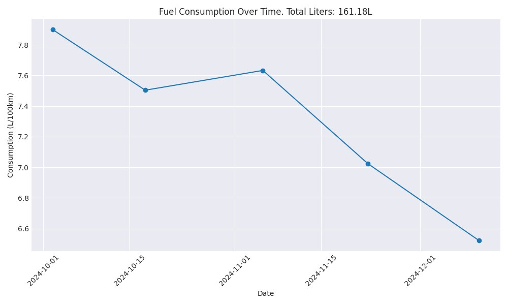
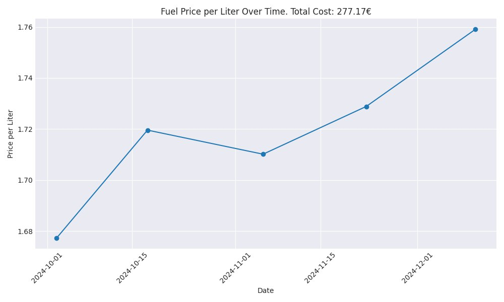
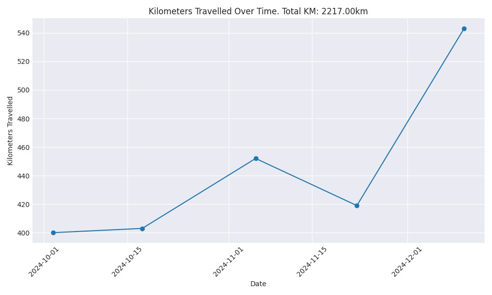

# 🚗 FuelGraph Bot

A Telegram bot that helps you track your vehicle's fuel consumption and visualize the data through beautiful graphs.

## 📊 Features

- Track your fuel refills easily through an intuitive Telegram interface
- Record price paid, liters refilled, and kilometers traveled
- Generate insightful graphs for different time periods
- Analyze your fuel consumption patterns
- View price per liter trends
- Monitor distance traveled over time

## 🛠️ Tech Stack

- Python (Telegram Bot)
- MongoDB (Data Storage)
- Docker & Docker Compose (Containerization)
- Matplotlib/Plotly (Graph Generation)

## 🚀 Getting Started

1. Clone this repository
```bash
git clone <your-repo-url>
cd fuelgraph-bot
```

2. Create a `.env` file in the root directory:
```bash
TELEGRAM_BOT_TOKEN=your_bot_token_here
MONGODB_URI=mongodb://mongodb:27017/
```

3. Start the containers:
```bash
docker-compose up -d
```

## 📱 Usage

1. Start a chat with [@YourBotName] on Telegram
2. Use the `/start` command to get started
3. Follow the intuitive button interface to:
   - Add new refill data
   - Generate graphs
   - View statistics

## 📈 Available Graphs

- Price per liter over time
- Total fuel consumption
- Distance traveled
- Cost analysis
- Efficiency metrics (km/L)

## 🤝 Contributing

Contributions are welcome! Please feel free to submit a Pull Request.

## 📝 License

This project is licensed under the MIT License - see the LICENSE file for details.

## 🙏 Acknowledgments

- [python-telegram-bot](https://github.com/python-telegram-bot/python-telegram-bot) library
- MongoDB team for the amazing database
- All contributors and users of FuelGraph

## Examples

  

  

  

